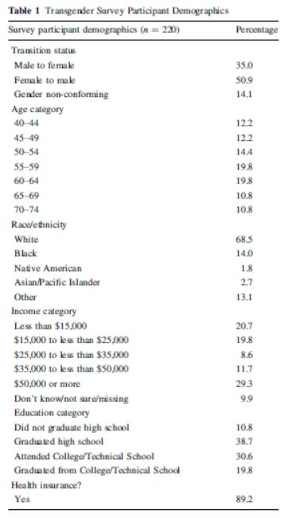
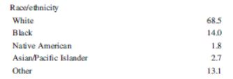
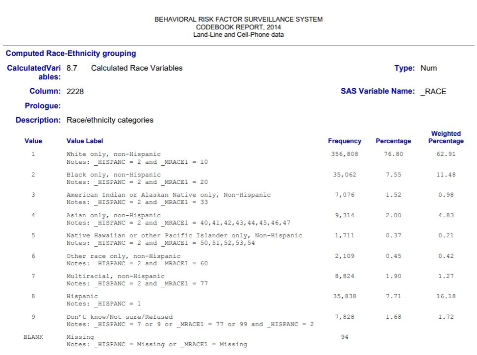
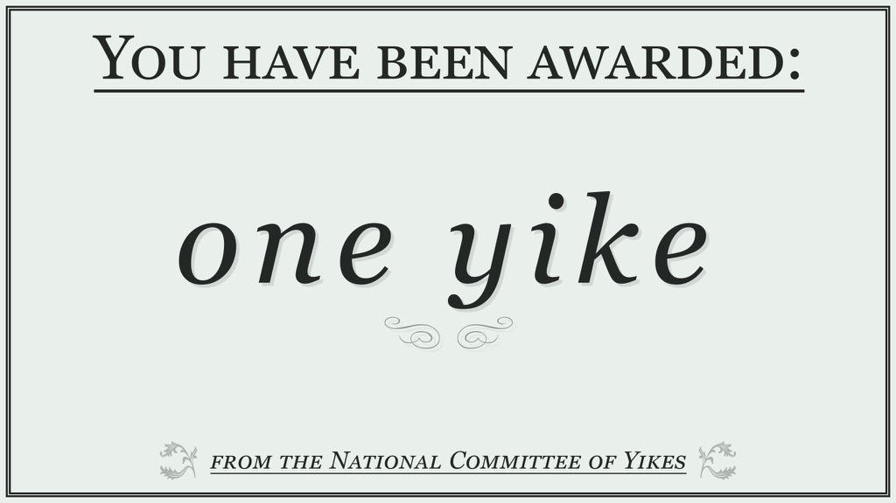
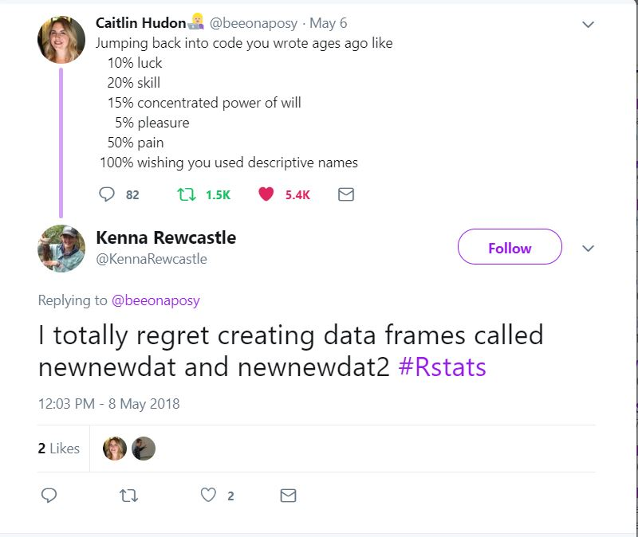

##What is reproducibility?

same data + same code

* This analysis is **repeatable** 

<p>same data + same or new code = same results

* This analysis is **reproducible** 

<p>new data + new code = same results 

* This analysis is **replicable** 

---

##Science is facing a reproducibility crisis

- 21% of 67 drug studies were reproducible (Prinz et al., 2011) 

- 40-60% of psychology studies were reproducible (Open Science Collaboration, 2015) 

- 61% of economics studies were reproducible (Camerer et al., 2016) 

- 6% of p-values incorrectly reported in psychology papers (Nuitjen et al., 2004) 

- 11% of p-values incorrectly reported in medical papers (Garcia-Berthou et al., 2004) 

---

##Why is this a problem?

- Fraudulent or error-laden work wastes resources and puts people at risk

- Over 400,000 subjects were enrolled and 70,501 treated in studies citing retracted papers (Steen, 2011)

<center>
 

---

##How do errors occur?

<center>


---

##How do errors occur?
<center>


---

##What can we do about it?

- Use promising practices and existing guidelines to **format** statistical code 

    + Google's R Style Guide 
    
    + General coding guidelines from other software 
    
- **Document** data and code for sharing 
    
- **Share** data (when possible) and statistical code in a repository like GitHub 

---

##Formatting statistical code 

Three categories of code formatting: 

- Use space wisely 

- Choose meaningful names with consistent formatting 

- Introduce and explain your code 

---

##Code Formatting: Using space wisely

###Recommendation #1: Use white space to separate processes

Bad:

```{r, eval=FALSE}
code_data_avail<-cbind(table(r$Q25_2_1),table(r$Q25_2_2))
colnames(code_data_avail)<-c("Did you make your data publicly available?","Did you make your code publicly available?"); code_data_avail<-melt(code_data_avail); colnames(code_data_avail)<-c("avail","data_or_code","number")
fig2<-ggplot(code_data_avail, aes(data_or_code, number, fill=avail))+geom_col(position="dodge")+coord_flip()+theme(legend.position = 'top') + labs(y="Number of participants", x="", fill="")+scale_fill_manual(values=fills)
fig2
```

Better:

```{r, eval=FALSE}
code_data_avail<-cbind(table(r$Q25_2_1),table(r$Q25_2_2))
colnames(code_data_avail)<-c("Did you make your data publicly available?","Did you make your code publicly available?"); code_data_avail<-melt(code_data_avail); colnames(code_data_avail)<-c("avail","data_or_code","number")

fig2<-ggplot(code_data_avail, aes(data_or_code, number, fill=avail))+geom_col(position="dodge")+coord_flip()+theme(legend.position="top")+ labs(y="Number of participants", x="", fill="")+scale_fill_manual(values=fills)

fig2
```

---

##Code Formatting: Using space wisely

###Recommendation #2: Limit line length to 80 characters

```{r, eval=FALSE}
code_data_avail<-cbind(table(r$Q25_2_1),table(r$Q25_2_2))
colnames(code_data_avail)<-c("Did you make your data publicly available?", 
"Did you make your code publicly available?") 
code_data_avail<-melt(code_data_avail)
colnames(code_data_avail)<-c("avail","data_or_code","number")

fig2<-ggplot(code_data_avail, 
aes(data_or_code, number, fill=avail)) + 
geom_col(position="dodge")+
coord_flip()+ 
theme(legend.position='top')+ 
labs(y="Number of participants", x="", fill="")+ 
scale_fill_manual(values=fills)

fig2
```

---

##Code Formatting: Using space wisely

###Recommendation #3: Indent to group lines of code that belong together

```{r, eval=FALSE}
code_data_avail<-cbind(table(r$Q25_2_1),table(r$Q25_2_2))
colnames(code_data_avail)<-c("Did you make your data publicly available?",
                             "Did you make your code publicly available?") 
code_data_avail<-melt(code_data_avail)
colnames(code_data_avail)<-c("avail","data_or_code","number")

fig2 <- ggplot(code_data_avail, 
               aes(data_or_code, number, fill=avail))+
  geom_col(position="dodge")+  
  coord_flip()+ 
  theme(legend.position='top')+ 
  labs(y="Number of participants", x="", fill="")+ 
  scale_fill_manual(values=fills)
fig2
```

---

##Code Formatting: Using space wisely

###Recommendation #4: Add spaces around operators (=, +, -, <-, etc.)

```{r, eval=FALSE}
code_data_avail <- cbind(table(r$Q25_2_1), table(r$Q25_2_2))
colnames(code_data_avail) <- c("Did you make your data publicly available?",
                               "Did you make your code publicly available?") 
code_data_avail <- melt(code_data_avail)
colnames(code_data_avail) <- c("avail", "data_or_code", "number")

fig2 <- ggplot(code_data_avail, 
               aes(data_or_code, number, fill = avail)) +
  geom_col(position = "dodge") +  
  coord_flip() + 
  theme(legend.position = 'top') + 
  labs(y = "Number of participants", x = "", fill = "") + 
  scale_fill_manual(values = fills)
fig2

```

---

##Code Formatting: Choosing meaningful names with consistent formatting

###Recommendation #5: Use meaningful names for objects

Bad:

```{r, eval=FALSE}
code_data_avail <- cbind(table(r$Q25_2_1), table(r$Q25_2_2))
```

Better: replace `r` and `Q25_2_1` and `Q25_2_2` with meaningful names:

- `r` is the reproducibility survey, so replace with `repro.survey` 
- `Q25_2_1` is the question about making data publicly available, replace with `data.avail` 
- `Q25_2_2` is the question about making code publicly available, replace with `code.avail` 

```{r, eval=FALSE}
code_data_avail <- cbind(table(repro.survey$data.avail), 
                         table(repro.survey$code.avail))
```

---

##Code Formatting: Choosing meaningful names with consistent formatting

###Recommendation #6: Use dot.case, camelCase, or PascalCase for multi-part names

- Google's R Style Guide recommends:

    + dot.case for data frame and variable names (camelCase is also ok, but dot.case is preferred)
    
    + kCamelCase for constants 
    
    + UpperCamelCase for functions (a.k.a. PascalCase)

- Note that some formats might not work in certain software packages

---

##Code Formatting: Choosing meaningful names with consistent formatting

###Recommendation #7: Add meta-data to file names

- Include meta-data like the date and project name in file names

- Key principles:

    1. Machine readable
    
    2. Works with default ordering
    
    3. Human readable

- Examples:

    * 180228_raw_postProgram.csv
    
    * 180302_clean_postProgram.csv

---

##Code Formatting: Introduce and explain your code 

###Recommendation #8: Write a prolog to introduce the code

```{r}
# PROLOG   ################################################################

# PROJECT: NAME OF PROJECT HERE
# PURPOSE: MAJOR POINT(S) OF WHAT I AM DOING WITH THE DATA HERE
# DIR:     list directory(-ies) for files here
# DATA:    list dataset file names/availability here, e.g.,
#          filename.correctextention 
#          somewebaddress.com 
# AUTHOR:  AUTHOR NAME(S) 
# CREATED: MONTH dd, YEAR 
# LATEST:  MONTH dd, YEAR 
# NOTES:   indent all additional lines under each heading, 
#          & use the apostrophe hashmark bookends that appear  
#          KEEP PURPOSE, AUTHOR, CREATED & LATEST ENTRIES IN UPPER CASE, 
#          with appropriate case for DIR & DATA, lower case for notes 
#          If multiple lines become too much, 
#          simplify and write code book and readme. 

# PROLOG   ###############################################################
```

---

##Code Formatting: Introduce and explain your code 

###Recommendation #9: Annotate to clarify code purpose

- Use comments to:

    * Explain the reason for the code (if needed) 
    
    * Explain functionality or choices that are not obvious or are different from expected 
    
    * Identify hacks or errors that should be fixed or rewritten
    
```{r, eval=FALSE}
#check normality assumption for age variable
histoAge <- hist(age)
histoAge
```

- Avoid using comments to:

    * Explain poorly named objects 
    
    * Repeat things that can be easily understood from the code

---

##Code Formatting: Introduce and explain your code 

###Recommendation #10: Use function arguments

Ok: 

```{r, eval = FALSE}
# plot the frequency of coding practices
fig2 <- ggplot(code_data_avail, 
               aes(data_or_code, number, fill = avail))
```

Better:

```{r, eval = FALSE}
# plot the frequency of coding practices
fig2 <- ggplot(data = code_data_avail, 
               aes(x = data_or_code, y = number, fill = avail))
```

---

##Let's reproduce a table!

<center>


---

##Before we begin the workshop 

- Make a new folder on your laptop 
- Save the workshop R Markdown file in the folder 
- Make a subfolder called "data" inside the folder
- You should have a folder with two things inside it: 
    + The R Markdown file 
    + An empty subfolder called "data"

---

##Data importing

Code used to import and save the data described in the table from the internet (this takes a while):

```{r, eval=FALSE}
# open the haven package to read an xpt
library(package = "haven")

# create a temporary file to store the zipped file
# before you open it
temp <- tempfile(fileext = ".zip")

# use download.file to put the zipped file in the temp file
# this will take a couple of minutes depending on computer speed
download.file(url = "http://www.cdc.gov/brfss/annual_data/2014/files/LLCP2014XPT.zip",
              destfile = temp)

# unzip it and read it
brfss.2014 <- read_xpt(file = temp)

# save it to data folder
write.csv(x = brfss.2014, file = "data/brfss_2014.csv", row.names = FALSE)
```

---

##Data importing

Load libraries and import saved data:

```{r, eval=FALSE}
# open tidyverse for data management
library(package = "tidyverse") 

# open tableone for making a table
library(package = "tableone")

# import data 
brfss.2014 <- read.csv(file = "data/brfss_2014.csv")
```

```{r, echo=FALSE, message=FALSE}
library(tidyverse) 
library(tableone) # data managment
brfss.2014 <- read.csv(file = "data/brfss_2014.csv")
```

This is a massive data set! Luckily, they document it really well in the [codebook](https://www.cdc.gov/brfss/annual_data/2014/pdf/CODEBOOK14_LLCP.pdf). 

---

##Data selection 

Use `select()` in the `tidyverse` to select a subset of the variables for the table. Incude the `HADMAM` variable for reasons we will discover later. 

```{r}
# get a subset of variables 
brfss.2014.small <- brfss.2014 %>%
  select(TRNSGNDR, X_AGEG5YR, X_RACE, X_INCOMG,
         X_EDUCAG, HLTHPLN1, HADMAM)

# Take a quick look
summary(object = brfss.2014.small)
```

---

##Data selection 

The table does not include all 464,664 people in the data set. Reading through the paper and looking at the table you'd find that the table includes: 

- Three transgender statuses 
- Age groups for people between 40 and 74 years old 
- People who **responded** to the mammogram question 

Look in the codebook to see how these things are coded: 

- `TRNSGNDR` coded as 1, 2, or 3 (codebook page 83) 
- `X_AGEG5YR` coded as categories 5 to 11 (codebook page 108) 
- `HADMAM` response is *not BLANK* (codebook page 37) 

---

##Data selection 

- We can use `filter()` to keep only cases that fit these criteria 
- Keep the data management from before and add to it 

```{r}
# select variables and filter cases 
brfss.2014.small <- brfss.2014 %>% 
  select(TRNSGNDR, X_AGEG5YR, X_RACE, X_INCOMG,
         X_EDUCAG, HLTHPLN1, HADMAM) %>%
  filter(TRNSGNDR >= 1 & TRNSGNDR <= 3) %>%
  filter(X_AGEG5YR >= 5 & X_AGEG5YR <= 11) %>% 
  filter(!is.na(HADMAM))

# check data set
summary(object = brfss.2014.small)
```

---

##Data cleaning & management

- We have the variables and cases we need for the table in the `brfss.2014.small` data frame 
- Now we clean the data 
- Start with adding labels to `TRNSGNDR` using `mutate()` and `recode_factor()` (see codebook page 83 for variable labels)

```{r}
# recode TRNSGNDR
brfss.clean <- brfss.2014.small %>% 
  mutate(TRNSGNDR = recode_factor(.x = TRNSGNDR,
                                  `1` = 'Male to female',
                                  `2` = 'Female to male',
                                  `3` = 'Gender non-conforming'))
# Check your work
summary(object = brfss.clean)
```

---

##Data cleaning & management

Keep going: 
.pre[
```{r}
# recode transgender, age, income, educ, health plan
brfss.clean <- brfss.2014.small %>% 
  mutate(TRNSGNDR = recode_factor(.x = TRNSGNDR,
                                  `1` = 'Male to female',
                                  `2` = 'Female to male',
                                  `3` = 'Gender non-conforming')) %>%
  mutate(X_AGEG5YR = recode_factor(.x = X_AGEG5YR,
                                  `5` = '40-44',
                                  `6` = '45-49',
                                  `7` = '50-54',
                                  `8` = '55-59',
                                  `9` = '60-64',
                                  `10` = '65-69',
                                  `11` = '70-74')) %>%
  mutate(X_INCOMG = recode_factor(.x = X_INCOMG,
                                  `1` = 'Less than $15,000',
                                  `2` = '$15,000 to less than $25,000',
                                  `3` = '$25,000 to less than $35,000',
                                  `4` = '$35,000 to less than $50,000',
                                  `5` = '$50,000 or more',
                                  `9` = 'Don\'t know/not sure/missing')) %>%
  mutate(X_EDUCAG = recode_factor(.x = X_EDUCAG,
                                  `1` = 'Did not graduate high school',
                                  `2` = 'Graduated high school',
                                  `3` = 'Attended College/Technical School',
                                  `4` = 'Graduated from College/Technical School',
                                  `9` = NA_character_)) %>%
  mutate(HLTHPLN1 = recode_factor(.x = HLTHPLN1,
                                  `1` = 'Yes',
                                  `2` = 'No',
                                  `7` = 'Don\'t know/not sure/missing',
                                  `9` = 'Refused')) 
```
]

---

##Data cleaning & management 

.pre[
```{r}
# Check your work
summary(object = brfss.clean)

```
]

---

##Data cleaning & management

Recoding `X_RACE` is a little tricker, let's start by looking at the variable in `brfss.clean`:

```{r}
# table of race variable
table(brfss.clean$X_RACE)
```

How do we translate this into the table categories? 

 

---

##Data cleaning & management 

The codebook shows the following: 



---

##Data cleaning & management

For `X_RACE` it looks like: 

- `1` in the data is `White` in the table 
- `2` in the data is `Black` in the table 
- `3` in the data is `Native American` in the table 
- `4` & `5` in the data are `Asian/Pacific Islander` in the table 
- `6`, `7`, `8`, & `9` in the data are `Other` in the table 

We can add this and the `HADMAM` coding (see page 37 in the codebook) to the data cleaning.

---

##Data cleaning & management
.pre[
```{r}
# recoding with all variable labels
brfss.clean <- brfss.2014.small %>% 
  mutate(TRNSGNDR = recode_factor(.x = TRNSGNDR,
                                  `1` = 'Male to female',
                                  `2` = 'Female to male',
                                  `3` = 'Gender non-conforming')) %>%
  mutate(X_AGEG5YR = recode_factor(.x = X_AGEG5YR,
                                  `5` = '40-44',
                                  `6` = '45-49',
                                  `7` = '50-54',
                                  `8` = '55-59',
                                  `9` = '60-64',
                                  `10` = '65-69',
                                  `11` = '70-74')) %>%
  mutate(X_INCOMG = recode_factor(.x = X_INCOMG,
                                  `1` = 'Less than $15,000',
                                  `2` = '$15,000 to less than $25,000',
                                  `3` = '$25,000 to less than $35,000',
                                  `4` = '$35,000 to less than $50,000',
                                  `5` = '$50,000 or more',
                                  `9` = 'Don\'t know/not sure/missing')) %>%
  mutate(X_EDUCAG = recode_factor(.x = X_EDUCAG,
                                  `1` = 'Did not graduate high school',
                                  `2` = 'Graduated high school',
                                  `3` = 'Attended College/Technical School',
                                  `4` = 'Graduated from College/Technical School',
                                  `9` = NA_character_)) %>%
  mutate(HLTHPLN1 = recode_factor(.x = HLTHPLN1,
                                  `1` = 'Yes',
                                  `2` = 'No',
                                  `7` = 'Don\'t know/not sure/missing',
                                  `9` = 'Refused')) %>%
  mutate(X_RACE = recode_factor(.x = X_RACE, 
                                `1` = 'White',
                                `2` = 'Black',
                                `3` = 'Native American',
                                `4` = 'Asian/Pacific Islander',
                                `5` = 'Asian/Pacific Islander',
                                `6` = 'Other',
                                `7` = 'Other',
                                `8` = 'Other',
                                `9` = 'Other')) %>%
  mutate(HADMAM = recode_factor(.x = HADMAM,
                                `1` = 'Yes',
                                `2` = 'No',
                                `7` = 'Don\'t know/not sure/missing',
                                `9` = 'Refused'))
```
]

---

##Data cleaning & management


```{r}
# check the recoding
summary(object = brfss.clean)
```

---

##Make the table 

- Use `tableone` to  make a table of all the variables 
- Check the table against the one we are reproducing 

.pre[
```{r}
# make a table of all the variables in the data frame
CreateTableOne(data = brfss.clean)
```
]

---

##What went wrong?

- The transgender percentages are different 
- The race percentages are different 
- The overall n is different 

<center>


---

##What went wrong with the race variable?

**Native Hawaiians or other Pacific Islander** (category 5) category of `X_RACE` was coded as `Other` during recoding rather than as `Asian/Pacific Islander`.

.pre[
```{r}
# recoding with variable labels
brfss.clean <- brfss.2014.small %>% 
  mutate(TRNSGNDR = recode_factor(.x = TRNSGNDR,
                                  `1` = 'Male to female',
                                  `2` = 'Female to male',
                                  `3` = 'Gender non-conforming')) %>%
  mutate(X_AGEG5YR = recode_factor(.x = X_AGEG5YR,
                                  `5` = '40-44',
                                  `6` = '45-49',
                                  `7` = '50-54',
                                  `8` = '55-59',
                                  `9` = '60-64',
                                  `10` = '65-69',
                                  `11` = '70-74')) %>%
  mutate(X_INCOMG = recode_factor(.x = X_INCOMG,
                                  `1` = 'Less than $15,000',
                                  `2` = '$15,000 to less than $25,000',
                                  `3` = '$25,000 to less than $35,000',
                                  `4` = '$35,000 to less than $50,000',
                                  `5` = '$50,000 or more',
                                  `9` = 'Don\'t know/not sure/missing')) %>%
  mutate(X_EDUCAG = recode_factor(.x = X_EDUCAG,
                                  `1` = 'Did not graduate high school',
                                  `2` = 'Graduated high school',
                                  `3` = 'Attended College/Technical School',
                                  `4` = 'Graduated from College/Technical School',
                                  `9` = NA_character_)) %>%
  mutate(HLTHPLN1 = recode_factor(.x = HLTHPLN1,
                                  `1` = 'Yes',
                                  `2` = 'No',
                                  `7` = 'Don\'t know/not sure/missing',
                                  `9` = 'Refused')) %>%
  mutate(X_RACE = recode_factor(.x = X_RACE, 
                                `1` = 'White',
                                `2` = 'Black',
                                `3` = 'Native American',
                                `4` = 'Asian/Pacific Islander',
                                `5` = 'Other',                # coding change
                                `6` = 'Other',
                                `7` = 'Other',
                                `8` = 'Other',
                                `9` = 'Other')) %>%
  mutate(HADMAM = recode_factor(.x = HADMAM,
                                `1` = 'Yes',
                                `2` = 'No',
                                `7` = 'Don\'t know/not sure/missing',
                                `9` = 'Refused'))
```
]

---

##Check new coding 

.pre[
```{r}
# make a table of all the variables in the data frame
CreateTableOne(data = brfss.clean)
```
]

---

##What went wrong with the transgender variable and the sample size?

- The two "Refused" observations from `HADMAM` were removed from `TRNSGNDR` but were left in all other variables 
- Use `if_else()` to recode `TRNSGNDR` variable as `NA` for these two cases but leave all the other cases alone 

.pre[
```{r}
# recoding with variable labels
# fixing recoding error and selecting variables in the table 
brfss.clean <- brfss.2014.small %>% 
  mutate(TRNSGNDR = recode_factor(.x = TRNSGNDR,
                                  `1` = 'Male to female',
                                  `2` = 'Female to male',
                                  `3` = 'Gender non-conforming')) %>%
  mutate(TRNSGNDR = if_else(condition = HADMAM != 9,     # HADMAM is not 9
                            true = TRNSGNDR,             # if true keep TRNSGNDR value
                            false = as.factor(NA))) %>%  # if false make NA
  mutate(X_AGEG5YR = recode_factor(.x = X_AGEG5YR,
                                  `5` = '40-44',
                                  `6` = '45-49',
                                  `7` = '50-54',
                                  `8` = '55-59',
                                  `9` = '60-64',
                                  `10` = '65-69',
                                  `11` = '70-74')) %>%
  mutate(X_INCOMG = recode_factor(.x = X_INCOMG,
                                  `1` = 'Less than $15,000',
                                  `2` = '$15,000 to less than $25,000',
                                  `3` = '$25,000 to less than $35,000',
                                  `4` = '$35,000 to less than $50,000',
                                  `5` = '$50,000 or more',
                                  `9` = 'Don\'t know/not sure/missing')) %>%
  mutate(X_EDUCAG = recode_factor(.x = X_EDUCAG,
                                  `1` = 'Did not graduate high school',
                                  `2` = 'Graduated high school',
                                  `3` = 'Attended College/Technical School',
                                  `4` = 'Graduated from College/Technical School',
                                  `9` = NA_character_)) %>%
  mutate(HLTHPLN1 = recode_factor(.x = HLTHPLN1,
                                  `1` = 'Yes',
                                  `2` = 'No',
                                  `7` = 'Don\'t know/not sure/missing',
                                  `9` = 'Refused')) %>%
  mutate(X_RACE = recode_factor(.x = X_RACE, 
                                `1` = 'White',
                                `2` = 'Black',
                                `3` = 'Native American',
                                `4` = 'Asian/Pacific Islander',
                                `5` = 'Other',
                                `6` = 'Other',
                                `7` = 'Other',
                                `8` = 'Other',
                                `9` = 'Other')) %>%
  select(TRNSGNDR, X_AGEG5YR, X_RACE,X_INCOMG, X_EDUCAG, HLTHPLN1)
```
]
---

##Check new coding 

.pre[
```{r}
# make a table of all the variables in the data frame
CreateTableOne(data = brfss.clean)
```
]
---

##Success? :-\

- We reproduced the table, HOWEVER...
    + The `X_RACE` variable was either recoded incorrectly or the table was mislabeled 
    + Two cases were removed from the `TRNSGNDR` variable but not the other variables when computing the percentages
    
**BUT WAIT, THERE'S MORE**

- The `X_AGEG5YR` variable was derived from `AGE` in the original data set 
    + The number of people in categories 5-11 of `X_AGEG5YR` is not consistent with the number of people who reported being 40 through 74 years old as measured by the original `AGE` variable 
    + Using the `AGE` variable to get the subset for the table results in a different sample than using the `X_AGEG5YR` variable

<center>

    
---

##What can we do to improve?

- Format and organize statistical code for collaboration and sharing 
    + Consider using literate programming options like RMarkdown that integrate code with text and results 
- Share statistical code and data (when possible) 
- When statistical code cannot be shared, write methods sections that include enough detail to reproduce results 
    + Still use literate programming and good code formatting practices! 

<center>


---

##Other reproducibility resources

- We developed a **Toolkit** with tips and resources for increasing the reproducibility of analyses

    + [https://coding2share.github.io/ReproducibilityToolkit/](https://coding2share.github.io/ReproducibilityToolkit/)

- The modules in the toolkit cover

    + Making private data shareable 
    
    + Preparing statistical code to share (what we demonstrated today!) 
    
    + Creating codebooks and other documentation 
    
    + Using GitHub to share code and data publicly 

<center>
 

---

##Thanks!

Jenine Harris

[harrisj@wustl.edu](mailto:harrisj@wustl.edu)

<center>


